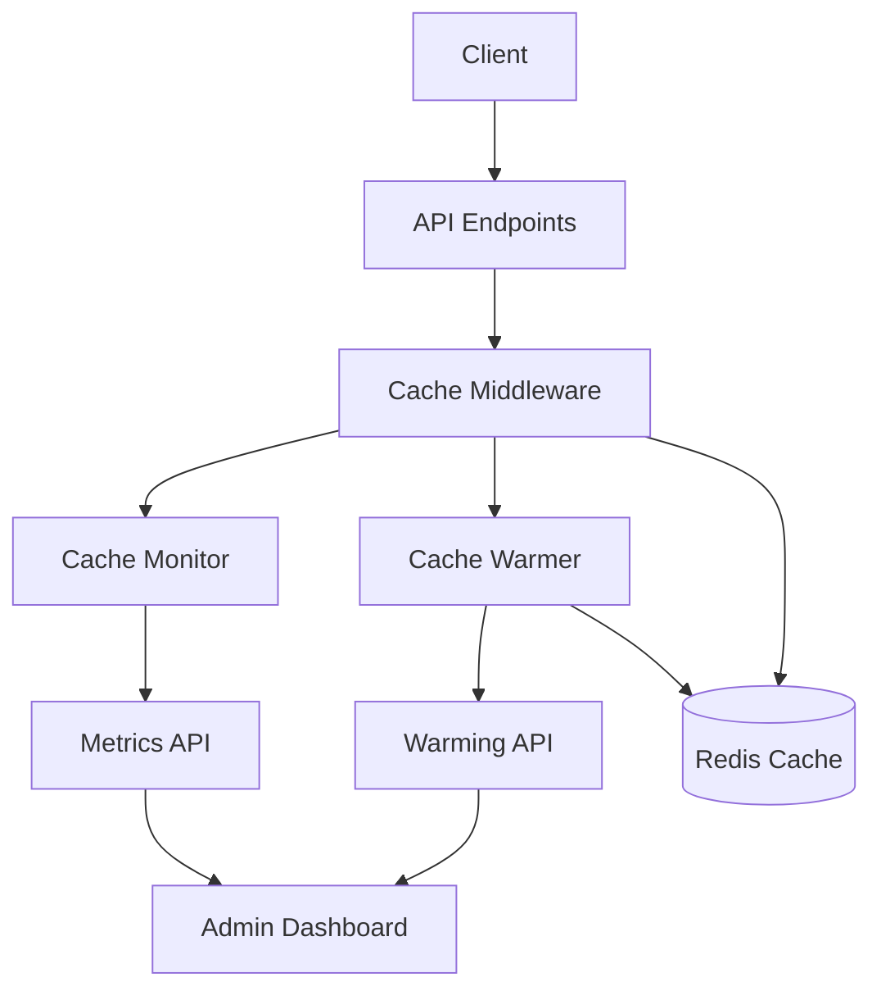

# Cache Monitoring and Warming Architecture

This document describes the architecture and components of the cache monitoring and warming system implemented in the chatbot platform.

## Overview

The cache monitoring and warming system enhances the performance and reliability of the caching middleware by:

1. **Monitoring** - Tracking cache hit/miss metrics to provide insights into cache performance
2. **Warming** - Pre-populating the cache with frequently accessed resources to improve response times

## Architecture Diagram



## Components

### Cache Monitor

The cache monitoring system tracks and records cache performance metrics:

- **Hit/Miss Rates** - Tracks the ratio of cache hits to total cache requests
- **Latency** - Measures the time taken to retrieve items from cache
- **Size** - Tracks the size of cached items
- **Resource Types** - Segments metrics by resource type (sentiment, conversation, etc.)
- **Time Series** - Maintains historical metrics for trend analysis

Configuration options include:
- Sample rate for high-traffic environments
- Log level for debugging
- Metrics collection interval
- Retention period for historical data

### Cache Warmer

The cache warming system pre-populates the cache with frequently accessed resources:

- **Access Tracking** - Records which resources are accessed most frequently
- **Periodic Warming** - Automatically warms the cache at configurable intervals
- **Threshold-Based** - Only warms resources that meet minimum hit thresholds
- **Resource Limiting** - Configurable limit on the number of resources to warm

Configuration options include:
- Warming interval
- Maximum items to warm
- Minimum hit threshold for warming

### Metrics API

The metrics API provides endpoints for monitoring cache performance:

- `GET /api/metrics/cache` - Returns current cache metrics
- `GET /api/metrics/cache/history` - Returns historical cache metrics
- `POST /api/metrics/cache/reset` - Resets cache metrics (admin only)
- `POST /api/metrics/cache/warm` - Triggers manual cache warming (admin only)

## Integration

The cache monitoring and warming system integrates with the existing caching middleware:

1. The cache middleware records hits and misses through the monitoring system
2. The cache middleware tracks resource access through the warming system
3. The warming system periodically pre-populates the cache with frequently accessed resources
4. The monitoring system provides metrics through the API for visualization and analysis

## Configuration

Configuration is managed through environment variables and the `cache.config.js` file:

```javascript
// Cache monitoring configuration
const monitoring = {
  enabled: process.env.CACHE_MONITORING_ENABLED !== 'false',
  sampleRate: process.env.CACHE_MONITORING_SAMPLE_RATE || 1.0,
  logLevel: process.env.CACHE_MONITORING_LOG_LEVEL || 'info',
  metricsInterval: process.env.CACHE_METRICS_INTERVAL || 60000, // 1 minute
  retentionPeriod: process.env.CACHE_METRICS_RETENTION || 86400000 // 24 hours
};

// Cache warming configuration
const warming = {
  enabled: process.env.CACHE_WARMING_ENABLED !== 'false',
  interval: process.env.CACHE_WARMING_INTERVAL || 300000, // 5 minutes
  maxItems: process.env.CACHE_WARMING_MAX_ITEMS || 100,
  minHits: process.env.CACHE_WARMING_MIN_HITS || 5
};
```

## Performance Considerations

- **Sampling** - For high-traffic environments, the monitoring system supports sampling to reduce overhead
- **Asynchronous Warming** - Cache warming runs asynchronously to avoid blocking API requests
- **Configurable Thresholds** - Minimum hit thresholds prevent warming infrequently accessed resources
- **Resource Limits** - Maximum item limits prevent excessive memory usage during warming

## Security

- **Admin-Only Access** - Cache metrics reset and manual warming endpoints require admin authentication
- **Monitoring Toggle** - Monitoring can be disabled in production if performance impact is a concern
- **Warming Toggle** - Warming can be disabled independently of monitoring

## Future Enhancements

- **Adaptive TTL** - Automatically adjust TTL based on access patterns
- **Predictive Warming** - Use machine learning to predict which resources will be needed
- **Real-time Dashboards** - Integrate with real-time monitoring dashboards
- **Alerting** - Set up alerts for cache performance issues
