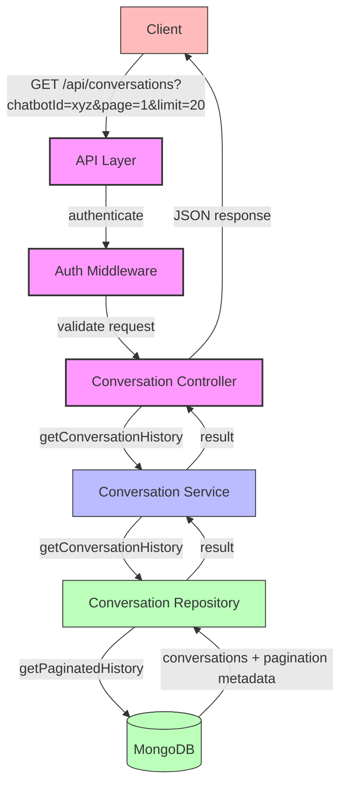

# Conversation History Pagination Architecture

## Overview

The conversation history pagination feature allows clients to retrieve paginated conversation history between a user and a chatbot. This document outlines the architecture and flow of this feature.

## Architecture Diagram



## Component Responsibilities

### API Layer
- Exposes RESTful endpoint for conversation history retrieval
- Handles HTTP request/response
- Applies authentication middleware
- Routes requests to the appropriate controller

### Authentication Middleware
- Validates user authentication token
- Ensures only authorized users can access conversation history
- Sets user information in the request object

### Conversation Controller
- Extracts and validates query parameters (chatbotId, page, limit)
- Calls the conversation service with appropriate parameters
- Formats and returns the API response
- Handles error cases and returns appropriate HTTP status codes

### Conversation Service
- Contains business logic for conversation history retrieval
- Validates business rules and permissions
- Calls the repository layer for data access
- Processes and transforms data as needed

### Conversation Repository
- Interacts with the MongoDB database
- Uses the Conversation model's static methods for data access
- Returns paginated results with metadata

### Conversation Model
- Defines the schema for conversation documents
- Provides static methods for data access operations
- Implements the pagination logic using MongoDB queries

## Data Flow

1. Client sends a GET request to `/api/conversations` with query parameters
2. Authentication middleware validates the user's token
3. Conversation controller extracts and validates parameters
4. Conversation service is called with the validated parameters
5. Conversation repository queries the database using the model's static method
6. MongoDB returns the paginated results
7. Results flow back through the layers with any necessary transformations
8. Client receives a JSON response with conversations and pagination metadata

## API Response Format

```json
{
  "conversations": [
    {
      "_id": "conversation_id",
      "userId": "user_id",
      "chatbotId": "chatbot_id",
      "messages": [
        {
          "content": "Hello",
          "sender": "user",
          "timestamp": "2025-06-09T13:15:20.000Z"
        },
        {
          "content": "Hi there! How can I help you today?",
          "sender": "bot",
          "timestamp": "2025-06-09T13:15:25.000Z"
        }
      ],
      "createdAt": "2025-06-09T13:15:20.000Z",
      "updatedAt": "2025-06-09T13:15:25.000Z"
    },
    // More conversations...
  ],
  "pagination": {
    "total": 25,
    "page": 1,
    "limit": 20,
    "pages": 2
  }
}
```

## Error Handling

- 400 Bad Request: Missing required parameters (e.g., chatbotId)
- 401 Unauthorized: Invalid or missing authentication token
- 403 Forbidden: User does not have permission to access the requested conversations
- 500 Internal Server Error: Unexpected server errors

## Performance Considerations

- Indexes are created on `userId`, `chatbotId`, and `updatedAt` fields for efficient queries
- Pagination limits the number of documents returned in a single request
- The `.lean()` method is used to return plain JavaScript objects instead of Mongoose documents for better performance
- Sorting is done on the database level rather than in application code
