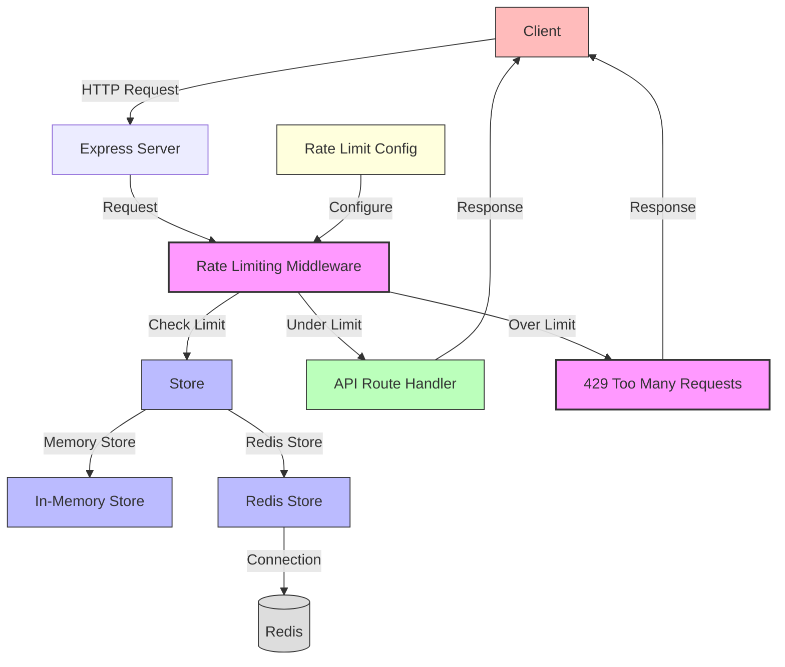

# Rate Limiting Middleware Architecture

## Overview

The rate limiting middleware provides protection against abuse of API endpoints by limiting the number of requests that can be made within a specified time window. This document outlines the architecture and flow of this feature.

## Architecture Diagram

## Component Responsibilities

### Express Server
- Receives HTTP requests from clients
- Applies middleware to requests
- Routes requests to appropriate handlers

### Rate Limiting Middleware
- Intercepts incoming requests
- Identifies the client (by IP, user ID, or custom key)
- Checks if the client has exceeded their rate limit
- Allows or rejects the request based on the rate limit
- Adds rate limit headers to responses

### Store
- Tracks request counts for each client
- Manages time windows for rate limiting
- Can be implemented as in-memory store or Redis store

### In-Memory Store
- Default store implementation
- Stores rate limit data in the application's memory
- Simple but not suitable for distributed environments

### Redis Store
- Optional store implementation for distributed environments
- Stores rate limit data in Redis
- Allows sharing rate limit data across multiple application instances

### Rate Limit Configuration
- Defines rate limit settings for different endpoints
- Specifies time windows and request limits
- Provides environment-specific configurations

## Data Flow

1. Client sends an HTTP request to the server
2. Express server receives the request
3. Rate limiting middleware intercepts the request
4. Middleware identifies the client using a key generator function
5. Middleware checks if the client has exceeded their rate limit
   - If using in-memory store, checks local memory
   - If using Redis store, checks Redis database
6. If the client is under the rate limit:
   - Increment the request count
   - Set expiration for the counter if it's new
   - Allow the request to proceed to the route handler
7. If the client has exceeded the rate limit:
   - Return a 429 Too Many Requests response
   - Include retry-after header if configured
8. Add rate limit headers to the response
   - RateLimit-Limit: Maximum requests allowed in the window
   - RateLimit-Remaining: Remaining requests in the current window
   - RateLimit-Reset: Time when the current window resets

## Configuration Options

### General Options
- `windowMs`: Time window in milliseconds
- `max`: Maximum number of requests within the window
- `message`: Response message when rate limit is exceeded
- `statusCode`: HTTP status code for rate limit responses (default: 429)
- `standardHeaders`: Whether to include standard rate limit headers
- `legacyHeaders`: Whether to include legacy X-RateLimit headers

### Advanced Options
- `keyGenerator`: Function to generate unique identifier for clients
- `handler`: Custom function to handle rate limit exceeded
- `skipFailedRequests`: Whether to skip failed requests (non-2xx responses)
- `skipSuccessfulRequests`: Whether to skip successful requests (2xx responses)

## Environment-Specific Configuration

### Development
- Higher limits for easier development and testing
- In-memory store for simplicity

### Test
- Disabled rate limiting for automated tests
- In-memory store for isolation

### Production
- Stricter limits to prevent abuse
- Redis store for distributed environments
- Different limits for different endpoints based on sensitivity

## Performance Considerations

- Redis store adds network overhead but enables distributed rate limiting
- In-memory store is faster but doesn't work across multiple instances
- Rate limiting adds minimal overhead to request processing
- Proper configuration prevents DoS attacks while allowing legitimate traffic
