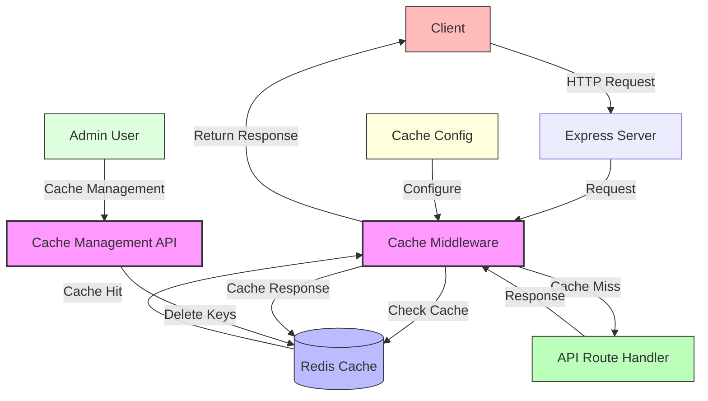

# Response Caching Middleware Architecture

## Overview

The response caching middleware provides performance optimization for API endpoints by caching responses and serving them for identical requests. This document outlines the architecture and flow of this feature.

## Architecture Diagram

## Component Responsibilities

### Express Server
- Receives HTTP requests from clients
- Applies middleware to requests
- Routes requests to appropriate handlers

### Cache Middleware
- Intercepts incoming requests
- Generates a cache key based on request data
- Checks if a response is available in the cache
- Returns cached response if available
- Passes request to route handler if cache miss
- Caches successful responses for future requests

### Redis Cache
- Stores cached responses with TTL (Time To Live)
- Provides fast access to cached data
- Enables sharing cache across multiple application instances

### API Route Handler
- Processes requests and generates responses
- Unaware of caching (separation of concerns)

### Cache Management API
- Provides endpoints for administrators to manage the cache
- Allows clearing cache entries by pattern

### Cache Configuration
- Defines caching settings for different endpoints
- Specifies TTL values and other caching parameters

## Data Flow

### Cache Hit Flow
1. Client sends an HTTP request to the server
2. Express server receives the request
3. Cache middleware intercepts the request
4. Middleware generates a cache key based on request data
5. Middleware checks if the response is available in Redis cache
6. If found (cache hit), the cached response is returned to the client
7. Request processing ends without reaching the route handler

### Cache Miss Flow
1. Client sends an HTTP request to the server
2. Express server receives the request
3. Cache middleware intercepts the request
4. Middleware generates a cache key based on request data
5. Middleware checks if the response is available in Redis cache
6. If not found (cache miss), the request is passed to the route handler
7. Route handler processes the request and generates a response
8. Middleware intercepts the response
9. If the response is successful (2xx status code), it is cached in Redis
10. Response is returned to the client

### Cache Bypass Flow
1. Client sends an HTTP request with cache bypass header or query parameter
2. Express server receives the request
3. Cache middleware intercepts the request
4. Middleware detects bypass request and skips cache check
5. Request is passed directly to the route handler
6. Response is not cached, even if successful

### Cache Management Flow
1. Administrator sends a request to clear cache
2. Cache management API validates administrator credentials
3. If authorized, API calls Redis to delete cache entries matching a pattern
4. Redis removes the matching cache entries
5. API returns success response with count of cleared entries

## Cache Key Generation

Cache keys are generated using the following request data:
- Request path
- Request body
- URL parameters
- Query parameters
- User ID (if authenticated)

This ensures that:
- Different users get their own cached responses
- Different request parameters result in different cache entries
- Same request from same user gets consistent cached response

## Configuration Options

### General Options
- `ttl`: Time to live for cache entries in seconds
- `prefix`: Prefix for cache keys to organize cache entries
- `enabled`: Whether caching is enabled
- `logHits`: Whether to log cache hits for monitoring

### Cache Control Options
- `bypassHeader`: HTTP header that can be used to bypass cache
- `bypassQuery`: Query parameter that can be used to bypass cache

## Performance Considerations

- Redis provides fast access to cached data with minimal latency
- Caching reduces database and CPU load for frequently requested data
- Cache TTL prevents stale data from being served indefinitely
- Cache key generation adds minimal overhead to request processing
- Cache bypass options allow forcing fresh data when needed

## Security Considerations

- Cache keys include user ID to prevent data leakage between users
- Cache management endpoints require administrator privileges
- No sensitive data is stored in cache keys
- Redis security best practices should be followed (authentication, network isolation)

## Monitoring and Maintenance

- Cache hit/miss rates should be monitored for effectiveness
- Cache size should be monitored to prevent memory issues
- TTL values should be adjusted based on data volatility
- Cache should be cleared during deployments with breaking changes
