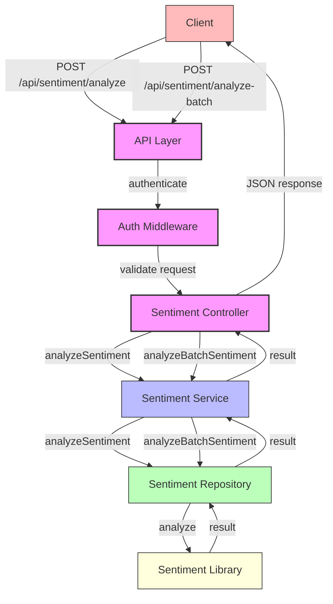

# Sentiment Analysis Microservice Architecture

## Overview

The sentiment analysis microservice provides API endpoints for analyzing the sentiment of text messages. This document outlines the architecture and flow of this feature.

## Architecture Diagram



## Component Responsibilities

### API Layer
- Exposes RESTful endpoints for sentiment analysis
- Handles HTTP request/response
- Applies authentication middleware
- Routes requests to the appropriate controller

### Authentication Middleware
- Validates user authentication token
- Ensures only authorized users can access sentiment analysis
- Sets user information in the request object

### Sentiment Controller
- Extracts and validates request body parameters
- Calls the sentiment service with appropriate parameters
- Formats and returns the API response
- Handles error cases and returns appropriate HTTP status codes

### Sentiment Service
- Contains business logic for sentiment analysis
- Validates business rules
- Calls the repository layer for data access
- Processes and transforms data as needed

### Sentiment Repository
- Interacts with the sentiment analysis library
- Handles the actual sentiment analysis logic
- Maps raw sentiment scores to meaningful categories
- Provides language detection capabilities

### Sentiment Library
- Third-party library for sentiment analysis
- Provides sentiment scores for text
- Used by the repository to analyze text sentiment

## Data Flow

### Single Text Analysis
1. Client sends a POST request to `/api/sentiment/analyze` with text in the request body
2. Authentication middleware validates the user's token
3. Sentiment controller extracts and validates the text parameter
4. Sentiment service is called with the validated text
5. Sentiment repository uses the sentiment library to analyze the text
6. Results flow back through the layers with any necessary transformations
7. Client receives a JSON response with sentiment analysis results

### Batch Text Analysis
1. Client sends a POST request to `/api/sentiment/analyze-batch` with an array of texts
2. Authentication middleware validates the user's token
3. Sentiment controller extracts and validates the texts array
4. Sentiment service is called with the validated texts array
5. Sentiment repository processes each text in parallel using the sentiment library
6. Results flow back through the layers with any necessary transformations
7. Client receives a JSON response with an array of sentiment analysis results

## API Response Format

### Single Text Analysis
```json
{
  "text": "I am very happy with the service",
  "sentiment": "positive",
  "score": 5,
  "confidence": 0.9,
  "language": "en"
}
```

### Batch Text Analysis
```json
[
  {
    "text": "I am very happy with the service",
    "sentiment": "positive",
    "score": 5,
    "confidence": 0.9,
    "language": "en"
  },
  {
    "text": "This is a regular message",
    "sentiment": "neutral",
    "score": 0,
    "confidence": 0.5,
    "language": "en"
  },
  {
    "text": "I am very disappointed with the service",
    "sentiment": "negative",
    "score": -4,
    "confidence": 0.8,
    "language": "en"
  }
]
```

## Error Handling

- 400 Bad Request: Missing required parameters (e.g., text or texts array)
- 401 Unauthorized: Invalid or missing authentication token
- 500 Internal Server Error: Unexpected server errors

## Performance Considerations

- Batch processing is done in parallel using Promise.all for better performance
- Simple language detection is implemented for basic language identification
- The sentiment library is lightweight and efficient for text analysis
- Error handling is implemented at each layer for robust operation
