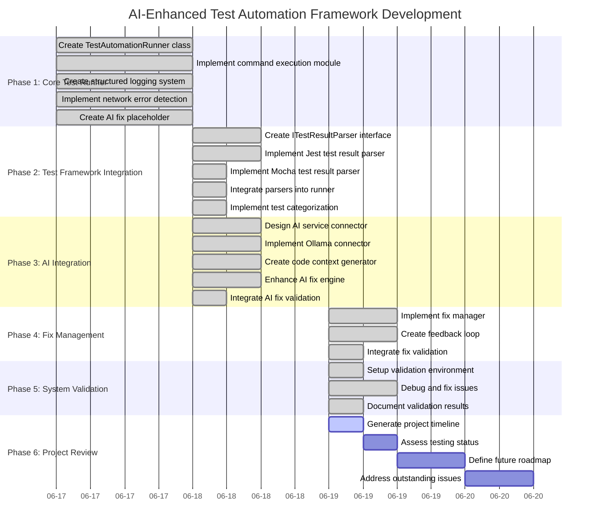

# AI-Enhanced Test Automation Framework - Project Timeline

## Development Timeline Visualization

## Key Milestones

| Date | Milestone | Description |
|------|-----------|-------------|
| 2025-06-17 | Project Initiation | Established project goals, persona, and testing strategy |
| 2025-06-17 | Phase 1 Completion | Core Test Runner Enhancement with basic functionality |
| 2025-06-18 | Phase 2 Completion | Test Framework Integration with Jest and Mocha parsers |
| 2025-06-18 | Phase 3 Completion | AI Integration with Ollama/CodeLlama for fix generation |
| 2025-06-19 | Phase 4 Completion | Fix Management with feedback loop implementation |
| 2025-06-19 | Phase 5 Completion | System Validation with comprehensive testing |
| 2025-06-19 | Project Review | Timeline creation, testing assessment, and roadmap definition |

## Development Progression

The project has followed a systematic approach, starting with core functionality and progressively adding more advanced features:

1. **Foundation Building** (Phase 1): Created the basic test runner with command execution and logging.
2. **Framework Integration** (Phase 2): Added support for multiple test frameworks through standardized parsers.
3. **Intelligence Layer** (Phase 3): Integrated AI capabilities for test failure analysis and fix generation.
4. **Quality Assurance** (Phase 4): Implemented fix validation and feedback mechanisms.
5. **System Verification** (Phase 5): Validated the complete system and fixed critical issues.
6. **Project Planning** (Phase 6): Reviewing progress and planning future enhancements.

This structured approach has allowed for incremental development and testing, with each phase building upon the previous one to create a comprehensive test automation framework with AI-driven fix capabilities.
